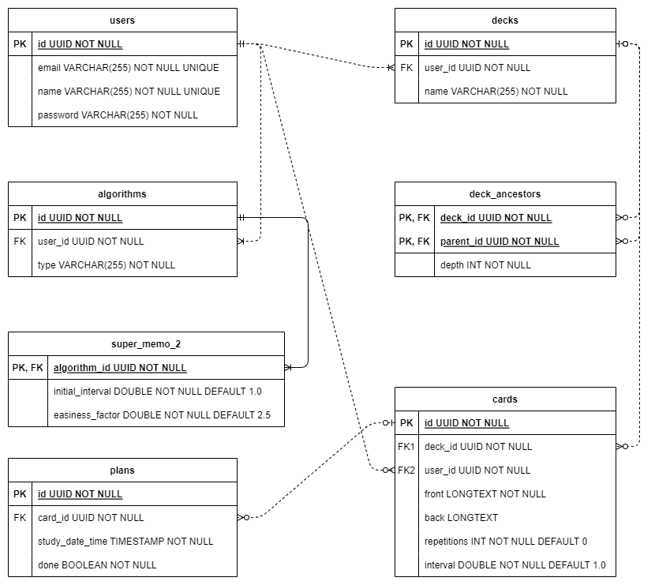

# 데이터베이스 설계

이전에 작성한 도메인 모델 및 API 설계를 바탕으로 데이터베이스를 설계하고 ERD를 작성하였습니다.

## ERD



### VARCHAR(255)

문자열 속성의 길이는 변경 가능성이 있거나, 정확한 길이를 알기 어려운 경우 255로 설정하였습니다. 이전에 성능 상에 문제가 염려되어 살펴본 결과 MySQL 기본 설정으로는 문제될 것이 없었습니다. 관련해서 작성한 글 [링크](https://limvik.github.io/posts/is-varchar-255-okay/)를 첨부합니다.

### UUID

ERD 상에서는 데이터타입을 UUID로 표시하기는 했지만, 실제 데이터타입은 UUID 길이에 맞춰 VARCHAR(36)으로 지정할 계획입니다.

### algorithms 와 super_memo_2

Flashcard 반복 간격을 계산하기 위한 알고리즘이 다양하고, 계산을 위한 Factor도 서로 다릅니다. 추후 확장 가능성을 생각하여 Algorithms 테이블과 지금 사용할 SuperMemo2 알고리즘의 사용자 설정 값을 저장할 super_memo_2 테이블을 별도로 정의하였습니다.

[SuperMemo2 문서 링크](https://www.super-memory.com/english/ol/sm2.htm)

### decks

카드를 담는 보관함인 decks는 카드를 구분하여 보관하기 위해 디렉터리 구조와 같이 트리(Tree) 구조로 구현할 계획입니다. 이를 위해 데이터베이스에 트리 구조를 표현해야 하는데, 이를 위한 패턴이 다양하게 존재합니다.

#### 트리 구조 패턴

MongoDB를 사용하는 것은 아니지만, 패턴은 유사하므로 MongoDB 문서([Model Tree Structure](https://www.mongodb.com/docs/manual/applications/data-models-tree-structures/))에 소개된 패턴을 기준으로 선택하였습니다.

##### Array of Ancestor

저는 [Array of Ancestors](https://www.mongodb.com/docs/manual/tutorial/model-tree-structures-with-ancestors-array/) 패턴을 선택했고, 이를 구현하기 위해 관계 테이블 `deck_ancestors`를 추가하였습니다.

Array of Ancestor 패턴은 조상들의 노드를 모두 배열 형태로 저장하는 방식입니다.

```java
db.categories.insertMany( [
  { _id: "MongoDB", ancestors: [ "Books", "Programming", "Databases" ], parent: "Databases" },
  { _id: "dbm", ancestors: [ "Books", "Programming", "Databases" ], parent: "Databases" },
  { _id: "Databases", ancestors: [ "Books", "Programming" ], parent: "Programming" },
  { _id: "Languages", ancestors: [ "Books", "Programming" ], parent: "Programming" },
  { _id: "Programming", ancestors: [ "Books" ], parent: "Books" },
  { _id: "Books", ancestors: [ ], parent: null }
] )
```

이를 표현한 트리 구조는 아래와 같습니다.


##### 다른 패턴 살펴보기

한 단계 상위 객체만 저장([Parent References](https://www.mongodb.com/docs/manual/tutorial/model-tree-structures-with-parent-references/)) 혹은 한 단계 하위 객체만 저장([Child References](https://www.mongodb.com/docs/manual/tutorial/model-tree-structures-with-child-references/))하는 패턴의 경우 하위 deck에 포함된 card를 찾기 위해 deck을 순차적으로 탐색하여 deck id를 모두 얻은 후 card를 조회하게 되어 비효율적입니다.

이진 트리 방식인 [Netsted Set](https://www.mongodb.com/docs/manual/tutorial/model-tree-structures-with-nested-sets/)패턴은 하위의 deck이 여러개가 될 수 있는 flashcards에는 적합하지 않습니다.

[Materialized Path](https://www.mongodb.com/docs/manual/tutorial/model-tree-structures-with-materialized-paths/) 패턴은 Array of Ancestor와 가장 유사합니다. 관계형에서는 Materialized Path에 1정규형을 적용하면 Array of Ancestor가 된다고 할 수 있겠습니다.

```java
db.categories.insertMany( [
   { _id: "Books", path: null },
   { _id: "Programming", path: ",Books," },
   { _id: "Databases", path: ",Books,Programming," },
   { _id: "Languages", path: ",Books,Programming," },
   { _id: "MongoDB", path: ",Books,Programming,Databases," },
   { _id: "dbm", path: ",Books,Programming,Databases," }
] )
```

구분자로 분리하는 수고를 해야하기는 하지만, 하나의 인스턴스의 한 컬럼에서 데이터를 불러오므로 성능이 좋습니다. 하지만, Flashcards에서 deck을 옮길 때 하위 deck들의 path를 수정하기 위해 문자열 조작을 해야하는 불편함과 데이터 무결성에 문제가 생길 가능성이 있습니다. 이전에 Console로 Flashcards를 만들어볼 때는 Materialized Path를 사용했었는데, 관계 설정을 통해 무결성을 보장하는게 얼마나 중요한지 잘 모르던 시절이었습니다.

위와 같은 이유로 다른 패턴을 Flashcards에 적용하기는 적합하지 않다고 판단되어 Array of Ancestor 패턴을 적용하였습니다.

참고로 Array of Ancestor 패턴을 RDBMS에서 구현하기 위해 `Closure Table`([참고 자료 링크](https://www.baeldung.com/cs/storing-tree-in-rdb#bd-closure-tables))로 구현합니다.

### cards

원래라면 직접 포함된 deck 뿐만 아니라, 상위 deck 까지 고려하면 다대다 관계로 관계 테이블이 필요했겠지만, 직접 포함된 deck id로 `deck_ancestors`테이블에서 상위 deck을 모두 조회할 수 있으므로 deck과 card의 관계를 1:다 관계로 설정하였습니다.

### plans

학습 기록이 저장되는 plans는 시간기록을 DATETIME 으로할지 TIMESTAMP로 할지 고민하다가, 개발 편의성을 위해 TIMESTAMP로 설정하였습니다.

DATETIME의 지원범위가 9999-12-31 23:59:59 까지이고, TIMESTAMP는 2038-01-19 03:14:07 까지라는 단점이 있기는 하지만, TIMESTAMP는 저장할 때는 UTC로 저장하지만 조회할 때는 시스템 변수 time_zone에 따라 변환되어 조회가 되기 때문에 편리합니다. 범위 제한의 문제는 10년 후에 고민해도 될 문제라 생각합니다.

MySQL 문서([링크](https://dev.mysql.com/doc/refman/8.1/en/datetime.html))를 참고하였습니다.